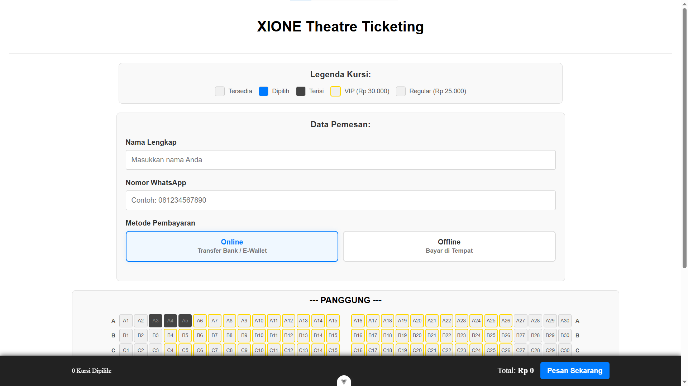
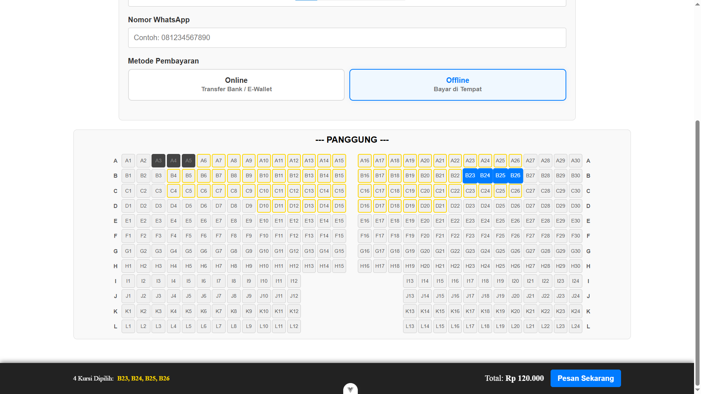
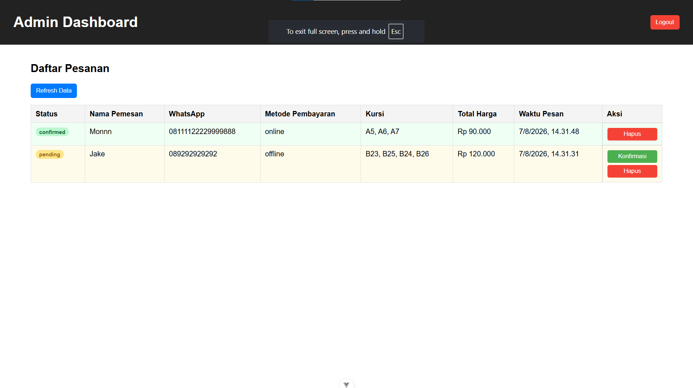

# 🎭 Xione Theatre Ticketing System

A modern web-based theatre ticket reservation system built to simplify ticket ordering, seat selection, and reservation management.

---

## 📖 Overview

Xione Theatre Ticketing System is a full-stack web application that allows customers to reserve theatre seats online while enabling administrators to manage orders and reservations efficiently.

This project was developed as a professional client project. The system was built to support an annual theatre event and has been used successfully for its production run; the development contract covered that single month's engagement. Frontend and backend are maintained as separate repositories due to being deployed on different hosting providers.

---

## ✨ Features

### Customer

- Interactive Theatre Seat Mapping
- Instant Seat Locking — the booked seat's status becomes "pending" and cannot be ordered by another guest until it is confirmed (accepted/rejected) by administrators
- Ticket Ordering With Form
- Auto-Cancellation Timer — orders with "pending" status that are not confirmed by administrators within 15 minutes will be automatically deleted, releasing back those seats

### Administrator

- Dashboard
- Manage Reservations
- Customer Management

---

## 🛠 Tech Stack

### Frontend

- Vue.js 3.5
- Pinia (State Management)
- Vue Router 4
- JavaScript
- HTML5
- CSS3
- Axios

### Backend

- Laravel 12.0
- PHP 8.2
- Laravel Sanctum 4.0 (Authentication)
- MySQL
- REST API
- Laravel Task Scheduling (Console Command) — for auto-cancellation pending orders.

---

## 🏗 System Architecture

```
Browser
      │
      ▼
Vue.js Frontend (Vercel)
      │
 REST API
      ▼
Laravel Backend (Paid Hosting)
      │
      ▼
MySQL Database
```

---

## ⏱ Key Technical Highlight: Seat Reservation & Smart-Timer

One of the main challenges of this system is preventing two guests from booking the same seat, while also ensuring that seats aren't held "hostage" indefinitely by orders that never get confirmed by an admin.

- **Seat Locking:** when a guest makes a booking, a new `Booking` is created with a `pending` status, which immediately makes that seat unselectable by other guests until an admin decides to accept or reject the order.
- **Smart-Timer (Auto-Cancellation):** run via a Laravel Console Command (`app:prune-bookings-v2`) invoked by the scheduler every minute (`Schedule::command(...)->everyMinute()`). This command finds all bookings with a `pending` status that were created more than 15 minutes ago, then deletes them so the seats become available again for booking.
- **Why not just a regular cron job:** this approach ensures seats aren't permanently "locked" due to orders left abandoned without admin confirmation, without needing a more complex background job/queue process.

---

## 📷 Screenshots

### Home

The homepage displays the ordering form and interactive seat map with legends.

### Seat Mapping

Customers select seats directly from the interactive theatre seat map with real-time availability status.

### Admin Dashboard

Admins can monitor all reservations and accept or reject pending orders from a single dashboard.

---

## 📂 Repository Structure

| Repository | Description |
|------------|-------------|
| Frontend | Vue.js Client Application |
| Backend | Laravel REST API |

### Frontend Repository
👉 https://github.com/Monnn-03/xione-frontend

### Backend Repository
👉 https://github.com/Monnn-03/xione-backend

---

## 👨‍💻 My Responsibilities

- Designed frontend interfaces
- Developed backend APIs
- Built theatre seat mapping
- Designed and implemented seat reservation logic, including smart-timer for automatic seat release
- Implemented total price calculation logic
- Developed ticket order management
- Designed MySQL database
- Integrated frontend with backend
- Deployment

---

## 📊 Database

ERD


---

## 🚀 Installation

See each repository for installation instructions.

Frontend: [xione-ticketing-frontend](https://github.com/Monnn-03/xione-frontend)
Backend: [xione-ticketing-backend](https://github.com/Monnn-03/xione-backend)

---

## 📄 License

This is a proprietary project developed for a client. Source code is shared here for portfolio purposes only, with permission from the client.

<!-- CATATAN: konfirmasi ke klien dulu sebelum publish, sesuaikan kalimat ini kalau ternyata belum ada izin eksplisit -->

---

## 👤 Author

**Ramon Riping**
Junior Web Developer

- GitHub: https://github.com/Monnn-03
- LinkedIn: https://www.linkedin.com/in/ramonriping